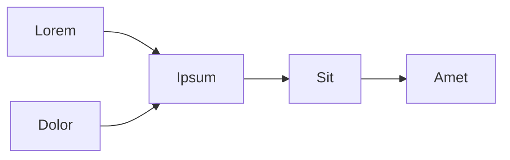

# Markdown rendering

Lorem ipsum dolor sit amet, consectetur adipiscing elit, sed do eiusmod tempor incididunt ut labore et dolore. A taste:

**Wikilinks** — [[interoperability|lorem ipsum dolor sit]].

**Embeds** — `![[image.png|300]]` lifts the size onto the `` tag.

**Callouts:**

> [!note]
> Lorem ipsum dolor sit amet, consectetur adipiscing elit.

**Math** — inline `$E = mc^2$` and block:

$$
\int_0^\infty e^{-x^2}\,dx = \frac{\sqrt{\pi}}{2}
$$

Inline math renders too: $e^{i\pi} + 1 = 0$.

Chemistry via mhchem (KaTeX can't parse this — it exercises the MathJax fallback): $\ce{2H2 + O2 -> 2H2O}$

**Mermaid:**

**Task lists:**

- [ ] Lorem ipsum dolor sit
- [x] Consectetur adipiscing elit
- [ ] Sed do eiusmod tempor

**Highlights** — ==marked text== renders as `<mark>`.

**Inline tags** — `#lorem`, `#ipsum`.

**Kanban** — dolor sit amet, consectetur adipiscing elit; those files render as plain task lists today, with board rendering on the way.

---

Sed ut perspiciatis unde omnis iste natus error, see the project repository on [GitHub](https://github.com/pawlenartowicz/).
